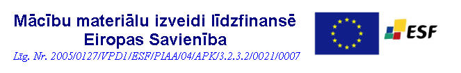

# RTU fizikas laboratorijas darbu materiāli (izstrādē)

Kopija tiem failiem, kas ir ORTUSā + "MarkDown" verisijas lai būtu vieglāk pārrakstīt no maziem ekrāniem, ļāujot pielāgot teksta izskatu.
## 1. daļa

- 1.1. Vienkāršie mērījumi
- 1.2. Vienmērīgi paātrinātas kustības pētīšana ar Atvuda iekārtu
- 1.3. Fizikālā svārsta īpašību pētīšana
- 1.4. Inerces momenta noteikšana izmantojot Maksvela svārstu
- 1.5. Rotācijas kustības pētīšana ar Oberbeka iekārtu
- 1.6.1. Lodītes kustības ātruma noteikšana ar ballistisko svārstu
- 1.6.2. Ķermeņa kustības ātruma noteikšana ar vērpes ballistisko svārstu
- 1.6.3 Mehaniskās enerģijas un impilsa nezūdamības likumu izpēte sadursmēs
- 1.7. Gāzes siltumietilpību attiecības noteikšana
    - 1.7.1. Gāzu adiabātas rādītāja noteikšana izmantojot Flammersfelda oscilatoru
- 1.8. Cietu ķermeņu inerces momenta noteikšana ar monofilāro piekari
- 1.9. Matemātiskais svārsts
    - 1.9.1. Rimstošās svarstības
- 1.10. Gāzu likumi
- 1.11. Skaņas ātruma noteikšana izmantojot Kunta metodi

## 2. daļa

- 2.1. Elektrisko mērinstrumentu pārbaude un mērdiapazona paplašināšana
- 2.2. Elektriskā lauka pētīšana
- 2.3. Vielu elektriskā vadītspēja un tās atkarība no temperatūras
    - 2.3.1. Vielu elektriskā vadītspēja un tās atkarība no temperatūras
- 2.5. Zemes magnētiskā lauka indukcijas horizontālās komponentes noteikšana ar tangensgalvanometru
- 2.6. Maiņstrāvas ķēde. Induktivitātes un kapacitātes noteikšana
- 2.7. RL ķēdes

## 3. daļa

- 3.2.1. Gaismas interference. Junga dubultsprauga
- 3.2.2. Gaismas interference. Ņūtona gredzeni
- 3.2.3. Freneļa biprizma
- 3.3. Difrakcijas režģis
- 3.4. Gaismas polarizācija
    - 3.4.1. Malī likuma eksperimentālā pārbaude
- 3.6. Fotoefekts
- 3.7.1. Monohromators

## Pielikums

- [Stjūdenta koeficienti](Stjūdenta%20koef-ti.md)
- Mērjumu rezultātu matemātiskās apstrādes pamati
- Aprēķināto vērtību noapaļošana

## Oficiālā anotācija

> Lekciju konspekta pamatā ir mācību grāmata
FIZIKA. A. Valtera redakcijā. Rīga, "Zvaigzne", 1992, 733 lpp.
> 
> Lekciju konspekta sagatavošanai izmantota arī cita literatūra:
> 1) A. Apinis, FIZIKA. Rīga, "Zvaigzne", 1972, 707 lpp.
> 2) R. Grabovskis, FIZIKA. Rīga, "Zvaigzne", 1983, 645 lpp.
> 3) J. Platacis, ELEKTRĪBA. Rīga, "Zvaigzne", 1985.
> 4) O. Students, OPTIKA. Rīga, "Zvaigzne", 1971.
> 5) Т. Трофимова, КУРС ФИЗИКИ. Москва, "Высшая школа", 2003, 542 стр.
> 6) Hugh D. Young, Roger A. Freedman, UNIVERSITY PHYSICS. USA, QC21.2Y67, 2000, pp.1513.

