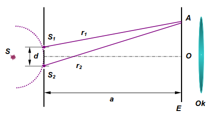
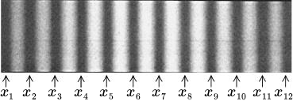

Laboratorijas darbs Nr.3.2.1, Junga dubultsprauga
===

Studenta vārds, uzvārds:
Fakultāte, grupa:
Studenta apliecības numurs:

## Teorētiskais pamatojums. Junga dubultsprauga

Parādību, kad divi vai vairāki viļņi vienlaikus iedarbojas kādā telpas punktā, sauc par interferenci. Interferenci dod, t.s., koherentie (saistītie) viļņu avoti, kas izstaro svārstības ar laikā nemainīgu fāzu starpību. Fāzu starpība var saglabāties laikā nemainīga tad, ja svārstību frekvences ir vienādas. Tāpēc koherentiem avotiem jādarbojas ar vienādām frekvencēm.

Koherentus gaismas viļņus var iegūt, sadalot vienu vilni divās daļās un pēc tam ļaujot šīm daļām pārklāties. Kā vienu no sadalīšanas veidiem izmanto Junga dubultspraugu, kuras principiālā shēma parādīta 1. attēlā



Par dubultspraugu sauc divas attālumā `d` paralēli novietotas vienādas spraugas `S_1` un `S_2`. 

Ja monohromatiskas gaismas vilnis no reāla gaismas avota `S` ir nonācis līdz dubultspraugai, kas novietota perpendikulāri gaismas staram, tad gaismas vilnis vienlaikus rada svārstības atbilstošajos punktos, kur novietotas spraugas `S_1` un `S_2`. 

Saskaņā ar Heigensa principu punkti `S_1` un `S_2` ir jauni viļņu avoti, kas dod viļņus visos virzienos un darbojas vienādās fāzēs. Tāpēc, šiem sekundārajiem viļņiem pārklājoties, rodas interferences aina - spraugām paralēlas gaišas un tumšas interferences joslas. To var novērot uz ekrāna vai arī izmantojot okulārmikrometru. Novērojamās interferences ainas izskats parādīts 2. attēlā. 



Saskaņā ar lekcijas par gaismas interferenci formulu (6.1.7), Junga dubultspraugas gadījumā attālums starp blakus esošajām interferences joslām (joslas platums) ir:
```LaTeX
h_0 = \frac{a}{d}\lambda_v       (1)
```
kur `a` ─ attālums no koherentajiem gaismas avotiem līdz interferences novērošanas vietai, `d` ─ attālums starp avotiem (spraugām), `λ_v` ─ gaismas viļņa garums gaisā. 

Mūsu gadījumā, lai palielinātu mērījumu precizitāti, nosakām attālumu nevis starp blakus esošām joslām, bet gan starp `m` joslām, tāpēc izteiksmes (1) kreiso un labo pusi reizinām ar joslu skaitu `m`. Tad kreisajā pusē izmantojot apzīmējumu `D=mh0`, attālums `D` starp m gaišām (vai tumšām) interferences joslām ir izsakāms:
```LaTeX
D = \frac{a}{d}m\lambda_v       (2)
```
kur `m` ─ interferences joslu skaits. Izteiksmi (2) izmanto dubutspraugas platuma `d` noteikšanai, ja ir zināms izmantotās gaismas viļņa garums vai arī viļņa garuma `λ_v` noteikšanai, ja spraugas platums zināms (dots vai tiek izmērīts ar mērmikroskopu). Attālums `a` no dubultspraugas līdz okulārmikrometram (līdz plaknei, kuras attēls redzams okulārā) var būt no dažiem desmitiem centimetru līdz 1 metram, un to mēra ar lineālu. 

Attālumu `D` starp interferences joslu (gaišo vai tumšo) viduslīnijām mēra ar okulārmikrometru, nosakot līniju koordinātes. Okulārmikrometra skala ir graduēta milimetros un to daļās. Veselo milimetru iedaļas novērojamas okulāra redzeslaukā vienlaikus ar interferences ainu, bet milimetra desmitdaļas un simtdaļas nolasāmas no mikrometriskās skrūves. Ja tiek nolasītas joslu koordinātes `x_i`, iespējams noteikt `D` pie dažādām `m` vērtībām. 

Piemēram, ja ir zināma 5. joslas koordināte `x_5` un 1. joslas koordināte `x_1`, tad `D = x_5 - x_1`, bet `m = 4`, jo starp 5. un 1. līniju atrodas 4 interferences joslas (skat. 2. attēlu).

Vēlams izdarīt vairākas interferences ainas mērījumu sērijas ─ katru ar citu attālumu `a`. Iespējams veikt mērījumus arī dažāda platuma dubultspraugām. Šajā gadījumā varam eksperimentāli pārliecināties, kā mainās interferences joslu platums atkarībā no dubultspraugas
platuma.

Attālums `d` starp spraugām parasti ir mazāks par 1 mm. To iespējams noteikt arī izmantojot mērmikroskopu. Veicot mērījumus ar mikroskopu, parasti ir grūti precīzi noteikt spraugas viduspunkta atrašanās vietu, tādēļ mērījumus veic pēc kārtas uz katras spraugas abām malām (labajām un kreisajām) un pēc šiem nolasījumiem aprēķina `d`.

## Iespējamie darba uzdevumi.

1. Noteikt gaismas viļņa garumu, lietojot dubultspraugu.
2. Noteikt attālumu starp spraugām, ja ir zināms izmantotā starojuma viļņa garums.
3. Noteikt dubultspraugas platumu, izmantojot mērmikroskopu. 